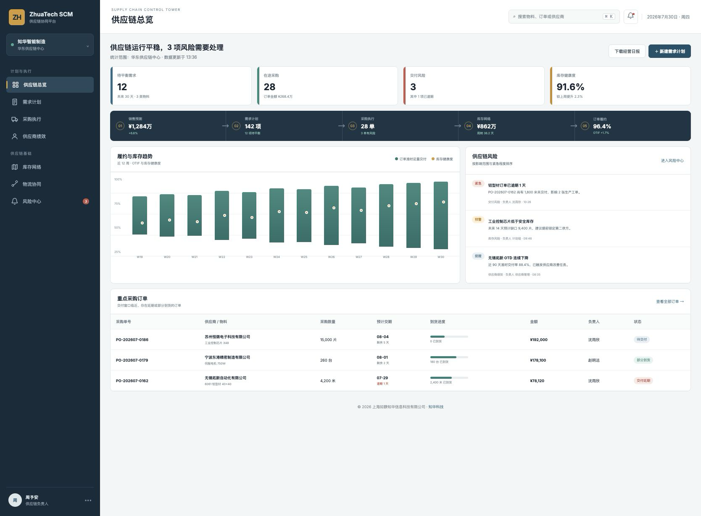
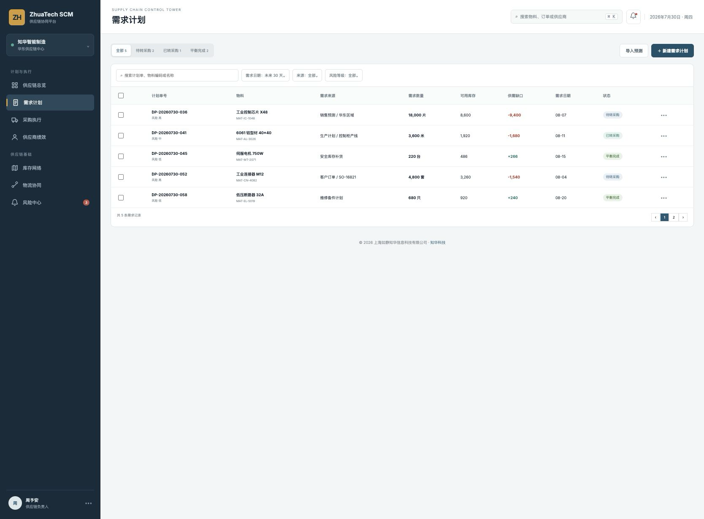
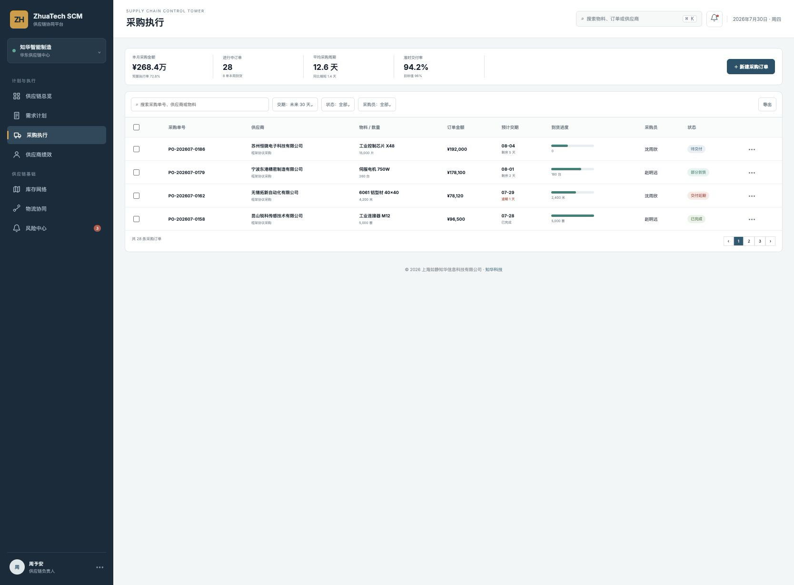
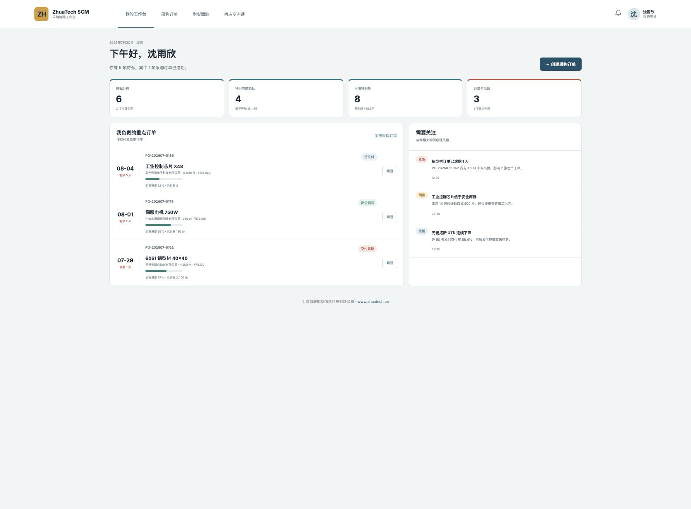

<div align="center">

# ZhuaTech SCM

**知华科技供应链协同平台 · 社区源码版**

把需求计划、采购执行、供应商绩效、库存网络与订单履约放到同一张供应链视图中。

[](backend/pom.xml)
[](backend/pom.xml)
[](frontend/package.json)
[](compose.yaml)
[](LICENSE)

**上海如静知华信息科技有限公司** · [知华科技官网](https://www.zhuatech.cn/)

</div>

## 库存覆盖与补货缺口

`POST /api/scm/inventory-coverage` 根据日均需求、现存量、在途量、安全库存和采购提前期，计算覆盖天数、订货点与建议缺口。覆盖期短于采购提前期时自动标记 `CRITICAL`，并建议加急采购或跨仓调拨。

> [!IMPORTANT]
> 本工程仅限个人学习、技术研究与非商业交流，不得用于任何商业用途。企业内部生产使用、收费交付、SaaS 服务、项目投标、二次销售、培训收费或其他经营行为，均须提前取得上海如静知华信息科技有限公司书面授权。完整条件以 [LICENSE](LICENSE) 为准。

## 一眼看懂这套系统

ZhuaTech SCM 是面向制造、商贸与供应链团队的 Java 供应链管理系统示例。社区源码版实现了从需求产生到采购到货的关键闭环，并提供管理驾驶舱与采购业务工作台。项目适合作为 **SCM 开源项目、Java 供应链系统、采购管理系统、供应商管理系统、需求计划系统、Vue 企业后台** 的学习参考。

```text
销售预测 / 客户订单 / 生产计划
              ↓
          需求归集与平衡
              ↓
    采购建议 → 采购订单 → 供应商确认
              ↓
        交付跟踪 → 到货入库
              ↓
      库存健康度与履约分析
```

## 页面实览

### 01 · 供应链控制塔

控制塔集中展示待平衡需求、在途采购、交付风险、库存健康度、OTIF 趋势及重点订单，让供应链负责人从风险开始安排工作。



### 02 · 需求计划与供需平衡

按销售预测、客户订单、生产计划和安全库存汇总需求，结合现有库存计算供需缺口，并跟踪需求转采购状态。



### 03 · 采购执行中心

围绕采购单、供应商、物料、金额、交付日期和到货进度组织日常业务，突出逾期、部分到货和临期订单。



### 04 · 采购专员协同工作台

业务工作台只保留个人待办、待供应商确认、本周到货和异常跟进，帮助采购专员处理每天最重要的事项。



## 已实现的社区版能力

| 领域 | 当前能力 |
| --- | --- |
| 需求计划 | 需求归集、需求日期、来源追踪、供需缺口与转采购状态 |
| 采购执行 | 采购订单创建、管理员审核、交付跟踪、分批到货与完成状态 |
| 供应商 | 供应商档案、合作等级、准时交付率、来料合格率与合作状态 |
| 物料库存 | 物料分类、计量单位、安全库存、当前库存与低库存识别 |
| 风险中心 | 交付逾期、库存短缺、供应商绩效预警与关闭处理 |
| 分析看板 | 采购金额、库存健康度、OTIF、重点订单及端到端业务流 |
| 身份权限 | JWT 登录；管理员、计划专员、采购专员角色权限 |
| 工程基础 | Flyway、Docker Compose、H2 集成测试、CI 与安全协作规范 |

## 技术与目录

- 后端：Java 21、Spring Boot 4、Spring Security、Spring Data JPA、JWT、Flyway。
- 前端：Vue 3、Vue Router、Pinia、Axios、Vite。
- 数据库：MySQL 8.4；测试环境使用 H2 MySQL 兼容模式。
- 工程包名：`cn.zhuatech.scm`；Maven Group：`cn.zhuatech`。
- 部署：Docker、Docker Compose、Nginx、多阶段构建。

```text
zhuatech-scm/
├── backend/src/main/java/cn/zhuatech/scm
│   ├── controller        # 认证、需求、采购、供应商与预警接口
│   ├── service           # 供需平衡与采购履约业务逻辑
│   ├── model             # 供应链领域实体
│   ├── repository        # JPA 数据访问
│   └── security          # JWT 安全链路
├── frontend/src
│   ├── views/admin       # 管理驾驶舱与业务管理页
│   └── views/planner     # 采购专员协同工作台
├── docs                  # API、架构、数据库和产品截图
└── compose.yaml          # MySQL、后端与前端一键编排
```

## 本地运行

最快查看界面的方式：

```bash
cd frontend
npm install
npm run dev:demo
```

管理端访问 `http://localhost:5173/admin/dashboard`，采购工作台访问 `http://localhost:5173/planner/workbench`。

完整环境可使用 Docker Compose：

```bash
cp .env.example .env
# 修改数据库密码和 JWT_SECRET
docker compose up --build -d
```

默认 Web 地址：`http://localhost:8090`；API 地址：`http://localhost:8080`。

| 角色 | 账号 | 初始密码 |
| --- | --- | --- |
| 供应链管理员 | `admin` | `admin123` |
| 计划专员 | `planner` | `plan123` |
| 采购专员 | `buyer` | `buyer123` |

> 演示账号仅供本地学习。实际部署前必须删除示例数据、更换所有密码，并使用足够强度的 JWT 密钥。

## 质量验证

```bash
cd backend && mvn test
cd ../frontend && npm run build:demo
```

API 摘要见 [docs/api.md](docs/api.md)，领域边界见 [docs/architecture.md](docs/architecture.md)，数据库表结构见 [docs/database.md](docs/database.md)。

## 可继续演进的方向

- S&OP、需求预测、MRP/MPS 与多级物料计划。
- 供应商准入、询比价、招投标、合同与价格目录。
- 供应商门户、交期承诺、ASN、质检、对账和发票协同。
- 多组织、多仓、多级库存网络与动态安全库存。
- 供应链风险图谱、交期预测、智能补货和替代料推荐。
- 对接 ERP、SRM、OMS、WMS、TMS、MES 与财务系统。
- 租户隔离、数据权限、审计日志、消息中心和高可用部署。

## 商业授权、实施与深度定制

如需将本项目用于企业生产环境，或需要供应链管理系统定制、采购数字化、供应商协同、库存优化、ERP/MES/WMS 集成、私有化部署及 AI 场景落地，请联系 **知华科技（上海如静知华信息科技有限公司）**。

- 官网：[https://www.zhuatech.cn/](https://www.zhuatech.cn/)
- 服务：技术咨询、企业信息化、软件项目外包、FDE、AI 落地、行业系统深度开发
- 微信：扫描以下任意二维码咨询

<table>
  <tr>
    <td align="center"></td>
    <td align="center"></td>
  </tr>
  <tr><td align="center">微信咨询一</td><td align="center">微信咨询二</td></tr>
</table>

## 参与社区

提交代码前请阅读 [CONTRIBUTING.md](CONTRIBUTING.md) 与 [CODE_OF_CONDUCT.md](CODE_OF_CONDUCT.md)，安全问题请按 [SECURITY.md](SECURITY.md) 私下报告。禁止提交真实供应商、联系人、采购价格、客户订单、密钥或生产数据库内容。

---

<div align="center">

**知华科技 · 让供应链协同更透明、更稳健**

© 2026 上海如静知华信息科技有限公司 · [www.zhuatech.cn](https://www.zhuatech.cn/)

</div>
